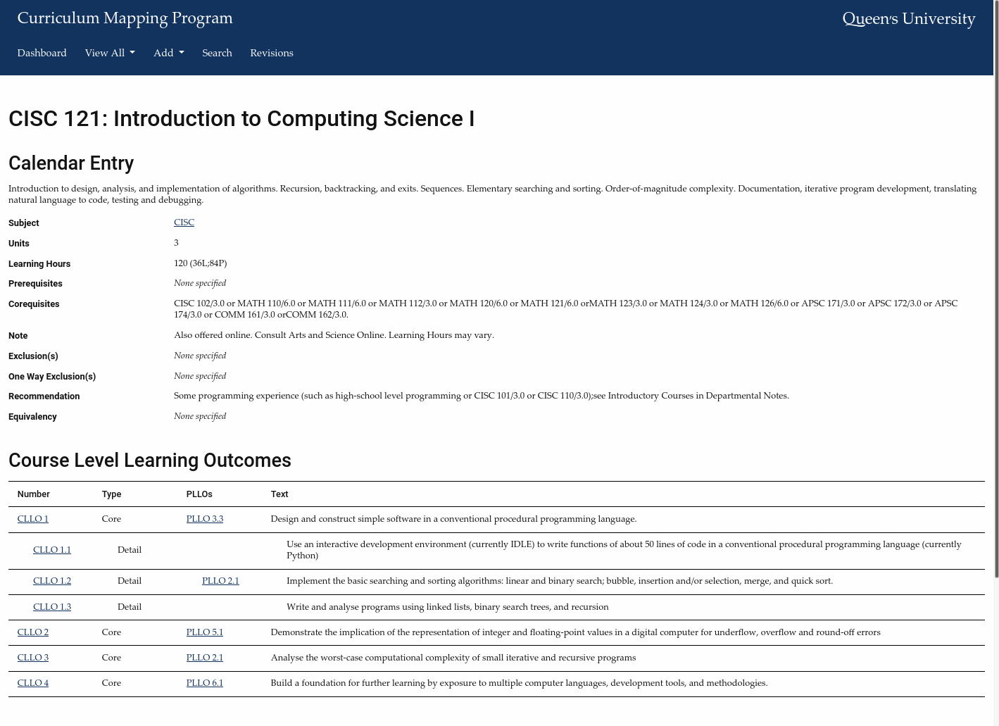
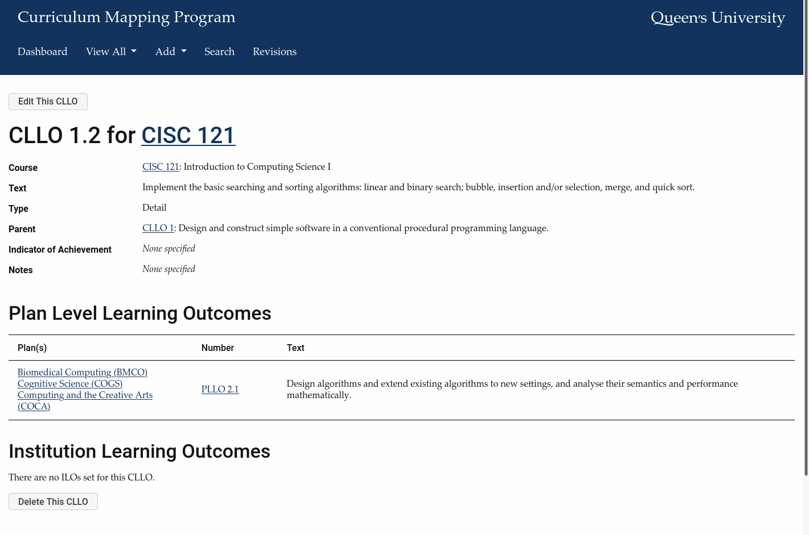
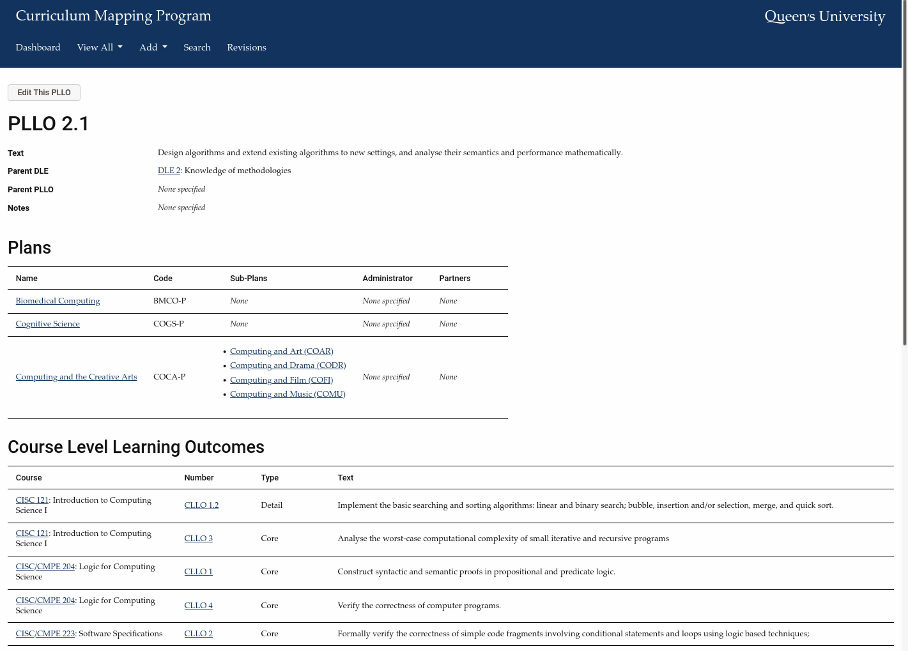
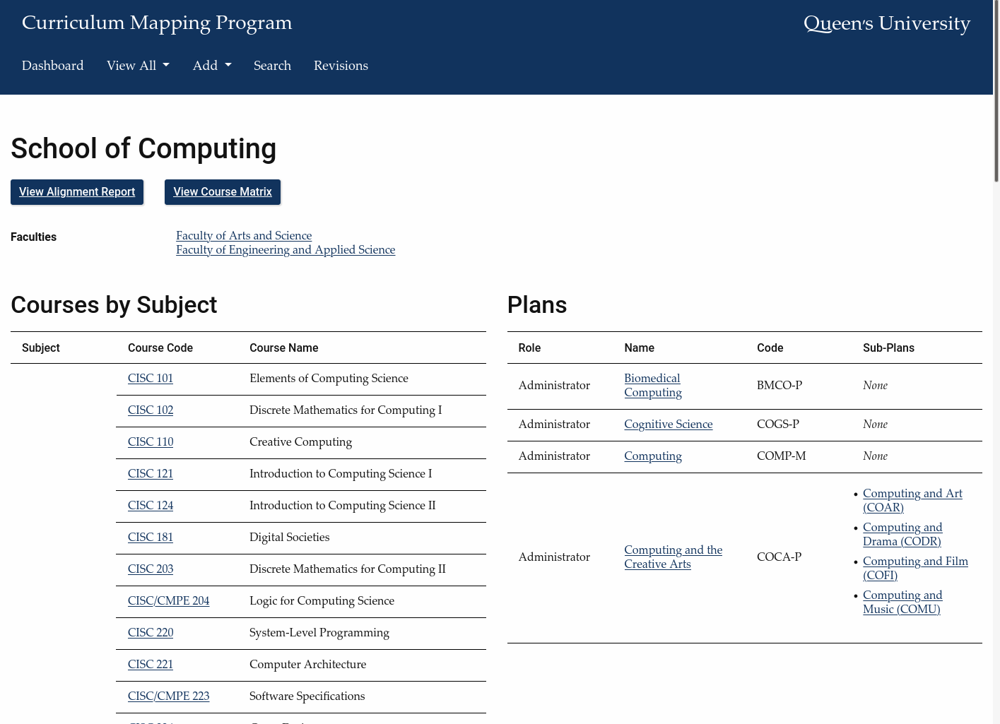
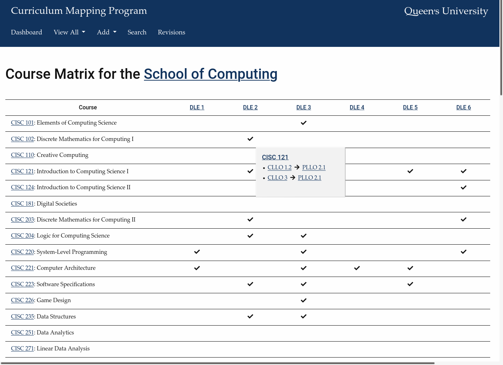
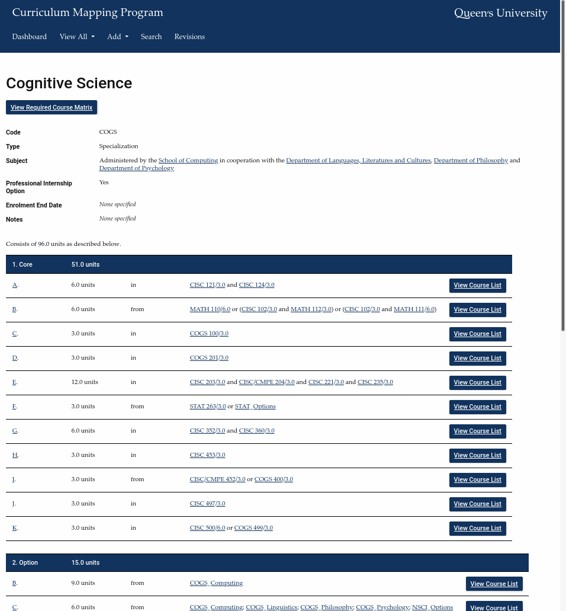
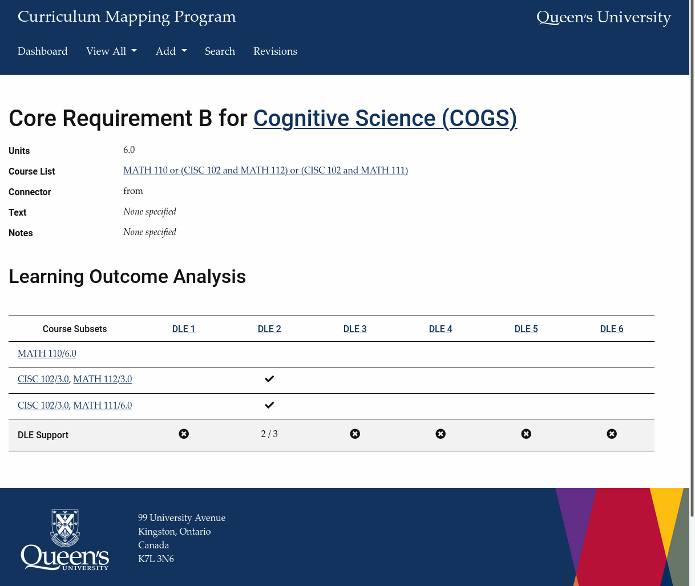
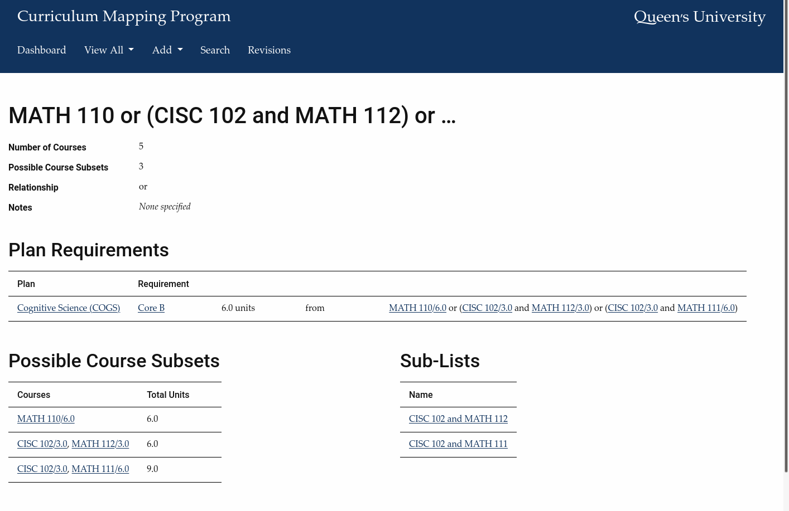

# QSC-CMP

## Features
QSC-CMP is a web application that assists in post-secondary curriculum mapping and analysis with respect to learning outcomes for:
- courses (CLOs/CLLOs); and,
- plans/programs (PLOs/PLLOs).

The system also supports the definition of:
- departments and faculties;
- plan/program course requirements; and,
- hierarchical lists of courses connected by relationships (*i.e.*, and, or, any).

### Screenshots
If you wish to see a demo of the software's complete functionality, please [contact the developer](mailto:sarah@cs.queensu.ca).

## Status
QSC-CMP is functioning correctly but not all planned features and improvements were completed as intended. Development of QSC-CMP was halted in June 2020 where
- add/edit/delete screens are in place for CLLOs and PLLOs
    - they are **not** in place for any other element (*e.g.*, plans, course requirements), which must be added manually in the database;
- all users have equivalent access to everything
    - *i.e.*, there are no user permissions to limit access to  content and/or functionality;
- course plan requirements are **not** hierarchical
    - *i.e.*, there is no way to specify a course plan requirement with 'one of' or 'two of' a series of sub-options;
- block comments in functions are complete
    - `phpDoc` comments for functions and classes are not complete
    - variables, functions and classes have been named verbosely
    - comments in JavaScript are less complete;
- revisions are not yet paginated
    - you'll have to clear out older entries in the `revisions` table periodically; and,
- some coding improvements (*e.g.*, argument arrays for functions with lengthy parameter lists) are not yet in place.

## Installation
You'll need a server with LAMP and the project QSC-CORE (also available on GitHub) installed alongside this one.

## Setup
Given the nature of the software, there's several aspects that require customization. Everything that requires setup is in the `/config` and `/js` folders.

### `config.php`
The file `/config/config.php` is the most important file in the system: it's `include`ed by every other file in QSC-CMP. You'll need to create this file and define your customizations in it.

The file `config-skeleton.php` is provided as the basis for `config.php` and is responsible for:
- `include`ing `QSC-CORE`;
- defining default constants and functions;
- overriding those defaults to suit your requirements; and,
- defining any custom constants and functions you need.

### `config.js`
The file `/js/config.js` is the JavaScript counterpart to `config.php`; `js/config-skeleton.php` is provided as the basis.

At the moment, `config.js` houses AJAX constants. The constant you'll most likely want to change is `QSC_CMP_AJAX_SCRIPTS_DIRECTORY` if your installation directory is not `qsc-cmp`.

### Installation Directories
The constant `QSC_CMP_DIRECTORY_LINK` defines QSC-CMP's installation directory and must be altered to match your directory structure. The same is true for `QSC_CORE_DIRECTORY_LINK` and QSC-CORE.

### Local Usage and/or Development
If you're using and/or developing the software locally, you'll need to set a few constants:
- `QSC_CMP_LOCAL_DEVELOPMENT` to `true`;
- `QSC_CMP_LOCAL_DEVELOPMENT_USER_ID` to your username for the database; and
- `QSC_CMP_LOCAL_DEVELOPMENT_USER_FIRST_NAME` and `QSC_CMP_LOCAL_DEVELOPMENT_USER_LAST_NAME` to your first and last names, respectively.

### User Login
The default function that handles user login is `qsc_cmp_log_user_in` in `/config/functions.php`. It handles login as follows:
- first, by checking `QSC_CMP_LOCAL_DEVELOPMENT` and "logging you in" using the associated constants;
- second, by attempting login via an (assumed) institution-based authentication system.

You can:
- define your own `qsc_cmp_log_user_in` function to override the default; and/or,
- define `qsc_cmp_log_user_in_institution(CurriculumMappingDatabase)` to interact with your institution's custom authentication system.

No matter what your setup, it is vital that your function(s) call the following on successful user login:
- `SessionManager::userLogin(...)` for the session variables; and,
- `CurriculumMappingDatabase.recordUserLogin(...)` for the database.

## Customizing the Databases
There are two essential classes which handle all database querying:
- `CurriculumMappingDatabase` in `/src/Managers/CurriculumMappingDatabase.php`; and,
- `CourseCalendarDatabase` in `/src/Managers/CourseCalendarDatabase.php`.

You can create alternate versions of these classes and replace the originals via `include_once` in `config.php`.

`CurriculumMappingDatabase` is defined exclusively to manage the data in QSC-CMP. It's lengthy and absolutely critical for every operation; it's unlikely that you'll want to override it. The tables for this database are in `tables/curriculum_mapping.sql`.

The opposite is true of `CourseCalendarDatabase` - it's short and easy to override. This gives you two options:
- define and populate a course calendar database with the table in `tables/courses.sql` and use `CourseCalendarDatabase` as written; or,
- create your own version of `CourseCalendarDatabase` that interacts with your institution's calendar system.
Thanks to Dr. Doug Martin in the School of Computing for the `courses` table; it is included here with his permission.

### Database Connection Information
The connection information for both database classes is collected using the return values from the following functions:

| Information | `CurriculumMappingDatabase` | `CourseCalendarDatabase` |
|------------|-------------------------|-----------------------|
| Host name | `qsc_cmp_get_cmd_host_name()` | `qsc_cmp_get_ccd_host_name()` |
| User name | `qsc_cmp_get_cmd_user_name()` | `qsc_cmp_get_ccd_user_name()` |
| Database name | `qsc_cmp_get_cmd_database_name()` | `qsc_cmp_get_ccd_database_name()` |
| Password | `qsc_cmp_get_cmd_database_password()` | `qsc_cmp_get_ccd_database_password()` |

These functions are defined in `config.php` but are empty and awaiting completion. It goes without saying that no passwords should be stored in plaintext in the document root.

## Information Stored in the Database
As you might expect, this software stores a fair amount of interconnected data:

| Component | Relationship/Associated With |
|-----------|-----------------|
| Faculty | |
| Department | Faculties, plans and subjects |
| Courses | Exactly one subject code and number (identical IDs handle cross-referenced courses with different calendar entries) |
| Degree-level expectations (DLEs) |  |
| Plan-level learning outcomes (PLLOs) | DLEs, sub-PLLOs and ILOs |
| Course-level learning outcomes (CLLOs) | Courses, sub-CLLOs, PLLOs and ILOs |
| Degree | |
| Program | Degrees |
| Plans | Programs and sub-plans |
| Text plan requirements (TPRs) | Plans |
| Course plan requirements (CPRs) | Plans and courselists |
| Courselists | Courses, sub-courselists, relationships and subjects |
| User | |
| Revision | |

## Background
The **Q**ueen's **S**chool of **C**omputing's **C**urriculum **M**anagement **P**rogram (QSC-CMP) was initially created to document and review course and program learning outcomes in the [School of Computing](https://www.cs.queensu.ca/) at [Queen's University](https://www.queensu.ca/) in Kingston, Ontario, Canada.

The software was later extended under the direction of the [Faculty of Arts and Science](https://www.queensu.ca/artsci/) and the [Office of the Vice-Provost (Teaching and Learning)](https://www.queensu.ca/provost/teaching-and-learning/vice-provost-teaching-and-learning) to provide full plan/program support, including the definition and analysis of course-based requirements.

QSC-CMP has been released as an open-source project by its creator and developer, [Dr. Sarah-Jane Whittaker](mailto:sarah@cs.queensu.ca).
